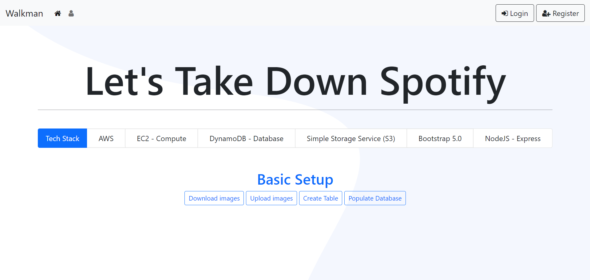
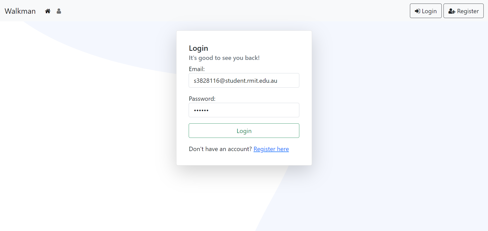
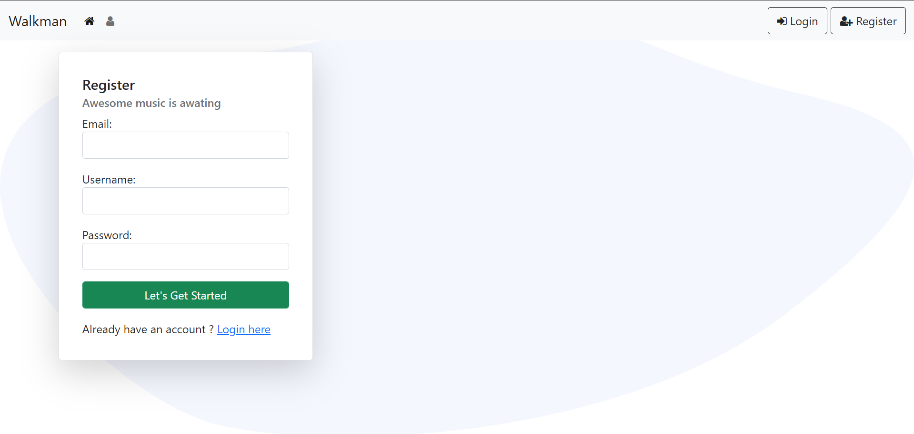

# Cloud Based Music Subscription Application

Created simple music subscription application as part of Cloud Computing assignment to demonstrate the understanding of -
* AWS EC2 
* AWS S3
* AWS DynamoDB

# Key Learnings

* Creating and Managing AWS IAM accounts, Billing, Budgets and Notifications
* Creating configuring AWS services such as EC2 instances, S3 buckets and DynamoDB
* Deploying and serving application using EC2
* Basic CRUD operations with DynamoDB
* Uploading objects to S3, managing bucket policies, making objects publically available.
* Using tools like SSH, WinSCP to access EC2 instance

# Application features

User can create an account using a unique email address.
Once registered, user has access to entire music library in the application. They can search for the music using title, year and artist name (Anything that matches). 
If there is any matching music records, user can then subscribe to it as well unsubscribe the already subscribed music.

# Tech-stack for application development

* NodeJS with Express
* Javascript and JQuery 3.x.x
* Bootstarp 5.x.x

# Challenges Faced

* Managing IAM credentials to manage app access to the cloud platform.
* Reading & understanding the AWS documentation


# Deployment Guide

1. Clone the repository
2. Download the AWS admin credentials for progamatic access
3. Create S3 bucket in preferred region
4. Create file /application_folder/config/aws_admin_credentials_for_programmatic_access.js and put following code.
    ```
    /**
     * AWS config object
     * The credentials in this file will be passed before making call to the AWS services
     * Make sure that these credentials are not shared with any body
     */
    const aws_config = {
        "username" : "",
        "password" : "",
        "acess_key_id" : "",
        "secret_access_key" : "",
        "region" : "",
        "console_login_link" : "",

        // S3 Bucket configuration
        "s3_config" : {
            "bucket_name" : "",
            "bucket_region" : ""
        }
    };

    module.exports = aws_config;
    ```
    (Update appropriate fields with your admin credentials and bucket information)

5. Install dependancies (Using cmd in application root folder)
   ```
   npm install
   ```
6. Run application using 
  ```
  node app
  ```
  
# Images
* Landing Page


* Login Page


* Registration Page


* User Main Page (Showing Subscribed Music)


* User Query Results


# Resources
[1] "Getting started in Node.js - AWS SDK for JavaScript", Docs.aws.amazon.com, 2021. [Online]. Available: https://docs.aws.amazon.com/sdk-for-javascript/v3/developer-guide/getting-started-nodejs.html. [Accessed: 10- Apr- 2021].

[2] "uuid", npm, 2021. [Online]. Available: https://www.npmjs.com/package/uuid. [Accessed: 10- Apr- 2021].

[3] H. libraries)?, M. Tilley and V. Yuan, "How to download a file with Node.js (without using third-party libraries)?", Stack Overflow, 2021. [Online]. Available: https://stackoverflow.com/questions/11944932/how-to-download-a-file-with-node-js-without-using-third-party-libraries. [Accessed: 10- Apr- 2021].

[4] "Creating and using Amazon S3 buckets - AWS SDK for JavaScript", Docs.aws.amazon.com, 2021. [Online]. Available: https://docs.aws.amazon.com/sdk-for-javascript/v3/developer-guide/s3-example-creating-buckets.html. [Accessed: 10- Apr- 2021].

[5] "Uploading Files to AWS S3 with Node.js", Stack Abuse, 2021. [Online]. Available: https://stackabuse.com/uploading-files-to-aws-s3-with-node-js/. [Accessed: 10- Apr- 2021].

[6] "express-session", npm, 2021. [Online]. Available: https://www.npmjs.com/package/express-session. [Accessed: 10- Apr- 2021].

[7] "Querying and Scanning a DynamoDB Table - AWS SDK for JavaScript", Docs.aws.amazon.com, 2021. [Online]. Available: https://docs.aws.amazon.com/sdk-for-javascript/v2/developer-guide/dynamodb-example-query-scan.html. [Accessed: 10- Apr- 2021].

[8] H. dynamodb, N. Goswami, N. Goswami and N. Goswami, "How to use “IN” statement in FilterExpression using array - dynamodb", Stack Overflow, 2021. [Online]. Available: https://stackoverflow.com/questions/40283653/how-to-use-in-statement-in-filterexpression-using-array-dynamodb. [Accessed: 27- Apr- 2021].

[9] "Creating and Using Tables in DynamoDB - AWS SDK for JavaScript", Docs.aws.amazon.com, 2021. [Online]. Available: https://docs.aws.amazon.com/sdk-for-javascript/v2/developer-guide/dynamodb-examples-using-tables.html. [Accessed: 10- Apr- 2021].

[10] "Reading and Writing A Single Item in DynamoDB - AWS SDK for JavaScript", Docs.aws.amazon.com, 2021. [Online]. Available: https://docs.aws.amazon.com/sdk-for-javascript/v2/developer-guide/dynamodb-example-table-read-write.html. [Accessed: 10- Apr- 2021].

[11] a. Mark Otto, "Navbar", Getbootstrap.com, 2021. [Online]. Available: https://getbootstrap.com/docs/5.0/components/navbar/. [Accessed: 10- Apr- 2021].

[12] a. Mark Otto, "Cards", Getbootstrap.com, 2021. [Online]. Available: https://getbootstrap.com/docs/5.0/components/card/. [Accessed: 10- Apr- 2021].
